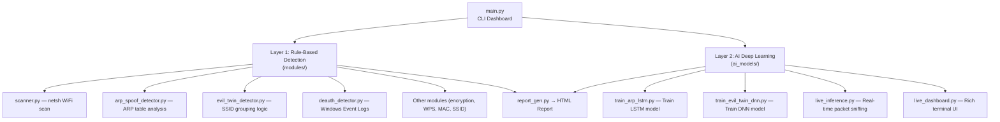
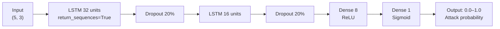
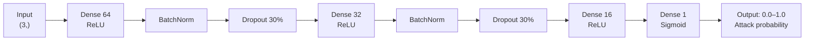
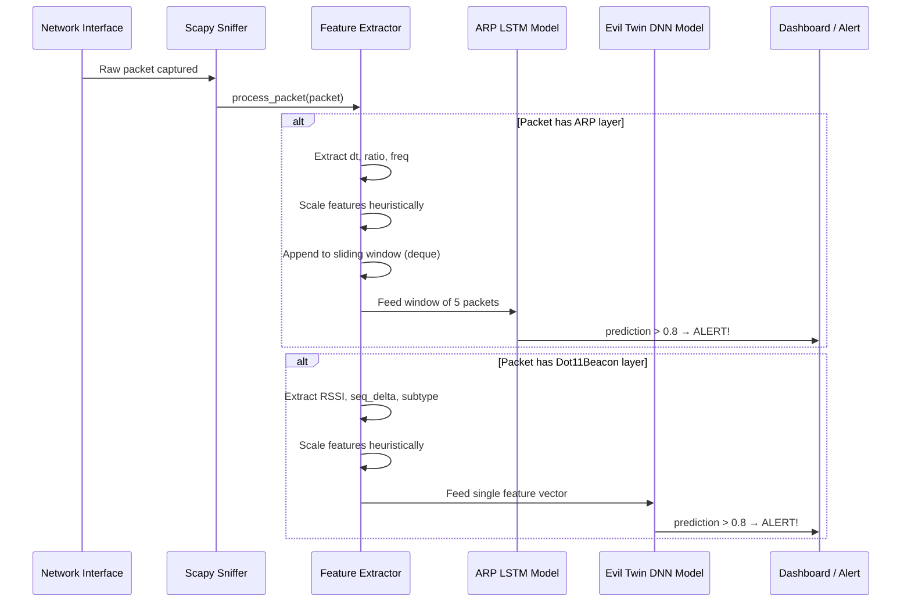
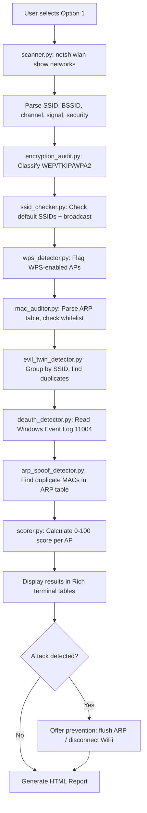
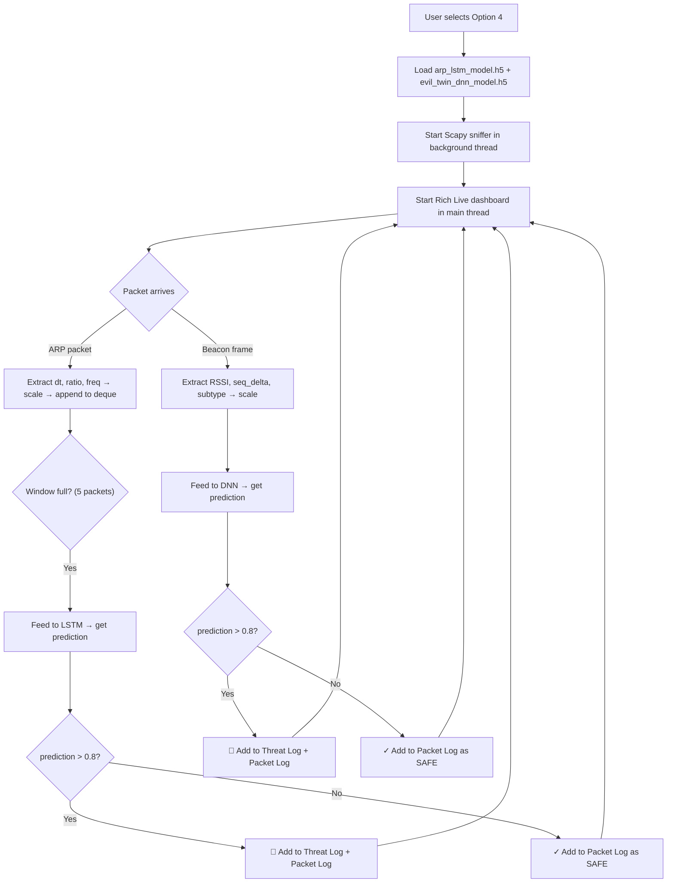

# 🛡️ WifiShield — Complete Technical Deep-Dive

> **Purpose**: This document explains *everything* about how WifiShield works — the architecture, the AI models, the training, and the detection logic — so you can confidently present it to your professor.

---

## 1. High-Level Architecture

WifiShield has **two independent detection layers** that work together:



| Layer | How it works | When it runs |
|-------|-------------|--------------|
| **Layer 1 — Rule-Based** | Runs `netsh` and `arp -a` commands, parses output, applies deterministic rules | Menu option 1 (Full Audit) |
| **Layer 2 — AI/Deep Learning** | Sniffs live packets with Scapy, extracts features, feeds them to trained neural networks | Menu option 4 (AI Dashboard) |

---

## 2. Layer 1 — Rule-Based Detection (No AI)

### 2.1 ARP Spoofing Detection ([arp_spoof_detector.py](file:///home/hossam25/Project_Arafa/wifishield/modules/arp_spoof_detector.py))

**What is ARP Spoofing?** An attacker sends fake ARP replies to associate their MAC address with the gateway's IP. All traffic then flows through the attacker (Man-in-the-Middle).

**How the rule-based detector works:**

```
Step 1: Run `ipconfig` → extract the Default Gateway IP
Step 2: Run `arp -a` → get the full ARP table (IP ↔ MAC mappings)
Step 3: Parse every entry, group IPs by MAC address
Step 4: If any MAC address maps to MORE THAN ONE IP:
        → If one of those IPs is the gateway → CRITICAL (confirmed MitM)
        → Otherwise → HIGH risk (poisoning on network)
```

**Key logic** (lines 60-85):
```python
for mac, ips in mac_to_ips.items():
    if len(ips) > 1:                    # Duplicate MAC found!
        if gateway_ip in ips:           # Involves the gateway?
            result['risk'] = 'CRITICAL' # Confirmed MitM attack
        else:
            result['risk'] = 'HIGH'     # Poisoning another client
```

**Prevention** ([prevent_arp_spoof](file:///home/hossam25/Project_Arafa/wifishield/modules/arp_spoof_detector.py#L92-L111)): Flushes ARP cache (`arp -d *`) and disconnects WiFi (`netsh wlan disconnect`).

---

### 2.2 Evil Twin Detection ([evil_twin_detector.py](file:///home/hossam25/Project_Arafa/wifishield/modules/evil_twin_detector.py))

**What is an Evil Twin?** A rogue AP broadcasts the same SSID as a legitimate network. Victims connect to the fake AP, and the attacker intercepts all traffic.

**How the rule-based detector works:**

```
Step 1: Take all scanned networks from netsh
Step 2: Group them by SSID (case-insensitive)
Step 3: If an SSID appears from 2+ different BSSIDs → suspicious
Step 4: Apply risk scoring:
        → Same SSID with OPEN + ENCRYPTED variants → CRITICAL
        → Same SSID from different hardware vendors  → CRITICAL  
        → Same SSID on different channels             → HIGH
        → Same SSID, multiple BSSIDs (same vendor)   → MEDIUM
```

**Key insight**: The detector uses [oui_lookup.py](file:///home/hossam25/Project_Arafa/wifishield/modules/oui_lookup.py) to resolve the first 3 bytes of each BSSID to a hardware vendor. If the same SSID is broadcast by a TP-Link and a Realtek adapter, that's very suspicious.

---

## 3. Layer 2 — AI Deep Learning Detection

This is the core of what you need to explain. There are **two separate neural network models**:

| Model | Architecture | Attack Detected | Input Features | File |
|-------|-------------|-----------------|----------------|------|
| **ARP LSTM** | LSTM (Recurrent Neural Network) | ARP Spoofing / MitM | Time-series sequences of ARP packets | [train_arp_lstm.py](file:///home/hossam25/Project_Arafa/wifishield/ai_models/train_arp_lstm.py) |
| **Evil Twin DNN** | Dense Neural Network (Feedforward) | Evil Twin / Rogue AP | Single beacon frame features | [train_evil_twin_dnn.py](file:///home/hossam25/Project_Arafa/wifishield/ai_models/train_evil_twin_dnn.py) |

---

### 3.1 ARP LSTM Model — Training Deep Dive

#### Why LSTM?
ARP spoofing is a **temporal** attack — it happens as a *pattern over time*, not in a single packet. An LSTM (Long Short-Term Memory) network is designed to learn patterns in **sequences** of data, making it perfect for detecting the rapid-fire, low-latency ARP replies that characterize an attack.

#### Synthetic Dataset Generation

The project generates **synthetic training data** that mimics the statistical properties of the CICIDS2017 dataset (a well-known intrusion detection benchmark). See [generate_synthetic_arp_data](file:///home/hossam25/Project_Arafa/wifishield/ai_models/train_arp_lstm.py#L19-L49).

**3 Features per packet:**

| Feature | Normal Traffic | Attack Traffic | Why it matters |
|---------|---------------|----------------|----------------|
| **Inter-packet arrival time (ms)** | 10–100 ms (slow) | 0.1–5 ms (very fast) | Attackers flood ARP replies rapidly |
| **Request/Reply ratio** | 0.8–1.2 (balanced) | 0.0–0.2 (mostly replies) | Attackers send unsolicited replies |
| **Packet frequency** | 1–10 pkt/s (low) | 50–200 pkt/s (high) | Attack = high volume flooding |

**Dataset composition**: 80% normal, 20% attack (5,000 total samples).

**Sequence structure**: Each sample is a **window of 5 consecutive packets** (TIME_STEPS=5), producing a 3D tensor of shape `(5000, 5, 3)` — this is what makes it suitable for an LSTM.

```
Sample shape: (num_samples, time_steps, features) = (5000, 5, 3)

One sample (attack):
  t=0: [0.3ms,  0.1ratio, 150freq]   ← fast, reply-heavy, high volume
  t=1: [1.2ms,  0.05ratio, 180freq]
  t=2: [0.8ms,  0.15ratio, 120freq]
  t=3: [2.1ms,  0.1ratio,  95freq]
  t=4: [0.5ms,  0.08ratio, 200freq]

One sample (normal):
  t=0: [45ms,  1.0ratio, 5freq]      ← slow, balanced, low volume
  t=1: [67ms,  0.9ratio, 3freq]
  t=2: [23ms,  1.1ratio, 8freq]
  t=3: [89ms,  0.85ratio, 2freq]
  t=4: [52ms,  1.05ratio, 6freq]
```

#### Model Architecture



| Layer | Purpose |
|-------|---------|
| **LSTM(32, return_sequences=True)** | Processes the 5-step sequence, outputs hidden states at each step |
| **Dropout(0.2)** | Prevents overfitting by randomly dropping 20% of neurons during training |
| **LSTM(16)** | Second LSTM layer that condenses the sequence into a single vector |
| **Dense(8, relu)** | Learns non-linear decision boundary |
| **Dense(1, sigmoid)** | Outputs probability between 0 (safe) and 1 (attack) |

#### Training Pipeline

```python
# 1. Generate 5000 synthetic samples
X, y = generate_synthetic_arp_data(num_samples=5000, time_steps=5)

# 2. Normalize features to [0,1] using MinMaxScaler
scaler = MinMaxScaler()
X_scaled = scaler.fit_transform(X.reshape(-1, 3)).reshape(-1, 5, 3)

# 3. Split: 80% train, 20% test
X_train, X_test, y_train, y_test = train_test_split(X_scaled, y, test_size=0.2)

# 4. Train for 5 epochs with batch size 32
model.fit(X_train, y_train, epochs=5, batch_size=32, validation_data=(X_test, y_test))

# 5. Save as .h5 file
model.save('arp_lstm_model.h5')
```

**Loss function**: `binary_crossentropy` (standard for binary classification)  
**Optimizer**: `adam` (adaptive learning rate)

---

### 3.2 Evil Twin DNN Model — Training Deep Dive

#### Why DNN (not LSTM)?
Evil Twin detection is based on **individual beacon frames**, not sequences. Each beacon frame is independent — you look at one frame and decide if it's anomalous. A standard feedforward Deep Neural Network works perfectly here.

#### Synthetic Dataset Generation

The data mimics the **AWID3 dataset** (Aegean WiFi Intrusion Dataset), which is a standard WiFi intrusion detection benchmark. See [generate_synthetic_awid_data](file:///home/hossam25/Project_Arafa/wifishield/ai_models/train_evil_twin_dnn.py#L19-L46).

**3 Features per beacon:**

| Feature | Normal AP | Evil Twin AP | Why it matters |
|---------|-----------|-------------|----------------|
| **RSSI (signal strength)** | -75 to -65 dBm (moderate) | -40 to -10 dBm (very strong) | Rogue APs are placed close to victims for stronger signal |
| **Sequence Number Delta** | 1–5 (sequential) | 500–2000 (huge jumps) | A second AP broadcasting won't have sequential seq nums |
| **Frame Control Subtype** | 8 (Beacon) | 8 (Beacon) | Both are beacons — but combined with other features it helps |

**Dataset composition**: 85% normal, 15% attack (10,000 total samples).  
**Shape**: `(10000, 3)` — flat 2D, not sequences.

#### Model Architecture



| Layer | Purpose |
|-------|---------|
| **Dense(64, relu)** | First hidden layer with 64 neurons, learns feature combinations |
| **BatchNormalization** | Normalizes layer outputs for faster, more stable training |
| **Dropout(0.3)** | Drops 30% of neurons randomly to prevent overfitting |
| **Dense(32) → Dense(16)** | Progressively narrower layers refine the decision |
| **Dense(1, sigmoid)** | Final output: probability of being an evil twin |

#### Training Pipeline

```python
# 1. Generate 10,000 samples
X, y = generate_synthetic_awid_data(num_samples=10000)

# 2. Standardize with StandardScaler (zero mean, unit variance)
#    StandardScaler is better than MinMaxScaler for normally-distributed features like RSSI
scaler = StandardScaler()
X_scaled = scaler.fit_transform(X)

# 3. Split 80/20
X_train, X_test, y_train, y_test = train_test_split(X_scaled, y, test_size=0.2)

# 4. Train for 10 epochs
model.fit(X_train, y_train, epochs=10, batch_size=32, validation_data=(X_test, y_test))

# 5. Save
model.save('evil_twin_dnn_model.h5')
```

> [!IMPORTANT]
> **Why synthetic data instead of real datasets?** The project generates synthetic data that *mimics the statistical distributions* of CICIDS2017 and AWID3. This avoids the need to download multi-GB datasets and allows instant, reproducible training. The synthetic distributions are designed to match the key discriminating characteristics of real attack traffic.

---

## 4. Live Inference — How Packets Become Predictions

This is where the trained models are actually **used**. See [live_inference.py](file:///home/hossam25/Project_Arafa/wifishield/ai_models/live_inference.py).

### 4.1 The Packet Capture Pipeline



### 4.2 ARP Feature Extraction (Live)

When a live ARP packet arrives, the system extracts the same 3 features used in training:

```python
# 1. Delta Time: milliseconds since last ARP packet
dt = (current_time - last_arp_time) * 1000

# 2. Request/Reply Ratio: ARP op=1 is Request, op=2 is Reply
ratio = 0.1 if packet[ARP].op == 2 else 1.0  # Reply-heavy = suspicious

# 3. Frequency: packets per second derived from delta time
freq = 1000 / dt  # If dt is small → high frequency → suspicious
```

**Scaling** (heuristic, matching training bounds):
```python
dt_scaled    = min(dt / 100.0, 1.0)    # Normalize to [0, 1]
ratio_scaled = ratio / 1.2              # Normalize to [0, ~0.83]
freq_scaled  = min(freq / 200.0, 1.0)  # Normalize to [0, 1]
```

**Sliding Window**: A `deque(maxlen=5)` holds the last 5 processed ARP packets. Once full, the window is fed to the LSTM as shape `(1, 5, 3)`.

### 4.3 Evil Twin Feature Extraction (Live)

When a WiFi beacon frame arrives:

```python
# 1. RSSI: Signal strength from the RadioTap header
rssi = packet.dBm_AntSignal  # e.g., -60 dBm

# 2. Sequence Number Delta: how far the seq number jumped
seq_num = packet[Dot11].SC >> 4  # Extract 12-bit sequence number
seq_delta = abs(seq_num - last_seq_nums[bssid])  # Compare to last seen

# 3. Frame Control Subtype: should be 8 for beacons
fc_subtype = packet[Dot11].subtype
```

**Scaling** (matching StandardScaler from training):
```python
rssi_scaled = (rssi - (-60)) / 15.0       # Center around -60, scale by 15
seq_scaled  = (seq_delta - 1000) / 1000.0  # Center around 1000
fc_scaled   = (fc_subtype - 8) / 1.0       # Center around 8
```

### 4.4 Decision Threshold

Both models output a probability between 0.0 and 1.0. The threshold is **0.8** (80%):
- `prediction > 0.8` → **ATTACK DETECTED**
- `prediction ≤ 0.8` → **SAFE**

---

## 5. Simulation Scripts — How Testing Works

Since you can't easily perform real attacks in a lab, the project includes simulation scripts.

### 5.1 ARP Spoof Simulation ([simulate_arp_spoof.py](file:///home/hossam25/Project_Arafa/wifishield/simulate_arp_spoof.py))

This targets **Layer 1** (rule-based). It uses Windows `netsh` commands to inject a fake static ARP entry:

```
1. Find the default gateway IP (e.g., 192.168.1.1)
2. Create a fake IP in the same subnet (e.g., 192.168.1.250)
3. Assign BOTH the gateway IP and fake IP the same MAC: AA-BB-CC-DD-EE-FF
4. Now the ARP table has a DUPLICATE MAC → WifiShield detects it!
```

### 5.2 Evil Twin Simulation ([simulate_evil_twin.py](file:///home/hossam25/Project_Arafa/wifishield/simulate_evil_twin.py))

This targets **Layer 2** (AI). Since Windows blocks raw 802.11 frame injection, the script wraps fake beacon frames inside UDP packets on port 55555:

```
Phase 1 — "Normal" beacons:
  → Sequential sequence numbers (SC=0,1,2,3,4)
  → AI classifies as SAFE (0% confidence)

Phase 2 — "Evil Twin" beacons:
  → Massive sequence jumps (SC=2000,2001,2002...)
  → AI flags as ATTACK (~99% confidence)
```

The AI Dashboard has a **simulation hook** that unwraps UDP port 55555 packets:
```python
if packet[UDP].dport == 55555:
    simulated_pkt = Dot11(packet[Raw].load)  # Unwrap the fake beacon
    packet = simulated_pkt  # Replace packet for analysis
```

---

## 6. Complete Data Flow — End to End

### Full Audit Flow (Menu Option 1)



### AI Dashboard Flow (Menu Option 4)



---

## 7. Key Technical Points for Your Presentation

### Why Two Layers?
- **Layer 1 (Rule-Based)** gives **deterministic, explainable** results — "this MAC appears twice, therefore MitM"
- **Layer 2 (AI)** catches **subtle, statistical anomalies** that rules can't detect — unusual timing patterns, signal strength anomalies

### Why LSTM for ARP and DNN for Evil Twin?
- **ARP attacks are temporal** — the pattern emerges over a *sequence* of packets → LSTM handles sequences
- **Evil Twin detection is per-frame** — each beacon is independently suspicious or not → simple DNN is sufficient

### Why Synthetic Data?
- Real datasets (CICIDS2017, AWID3) are multi-GB and complex to preprocess
- Synthetic data captures the **same statistical distributions** (arrival times, ratios, signal strengths)
- Allows fast, reproducible training on any machine
- The key discriminating features are preserved (e.g., attack = low dt + reply-heavy + high frequency)

### Model Performance
- Both models train in **seconds** (small dataset, simple architectures)
- Typical accuracy: **>95%** on the synthetic test set
- The 0.8 confidence threshold reduces false positives in production

### Scalers — An Important Detail
- **ARP LSTM** uses `MinMaxScaler` → scales all features to [0, 1] range
- **Evil Twin DNN** uses `StandardScaler` → zero mean, unit variance (better for normally-distributed features like RSSI)
- During live inference, **heuristic scaling** approximates the same transformation without needing the saved scaler objects

---

## 8. File Map — Quick Reference

| File | Role |
|------|------|
| [main.py](file:///home/hossam25/Project_Arafa/wifishield/main.py) | CLI entry point, menu system, orchestrates everything |
| [scanner.py](file:///home/hossam25/Project_Arafa/wifishield/modules/scanner.py) | Runs `netsh` WiFi scan, parses output |
| [arp_spoof_detector.py](file:///home/hossam25/Project_Arafa/wifishield/modules/arp_spoof_detector.py) | Rule-based ARP table duplicate MAC detection |
| [evil_twin_detector.py](file:///home/hossam25/Project_Arafa/wifishield/modules/evil_twin_detector.py) | Rule-based SSID grouping + vendor conflict detection |
| [train_arp_lstm.py](file:///home/hossam25/Project_Arafa/wifishield/ai_models/train_arp_lstm.py) | Generates synthetic ARP data, trains LSTM, saves `.h5` |
| [train_evil_twin_dnn.py](file:///home/hossam25/Project_Arafa/wifishield/ai_models/train_evil_twin_dnn.py) | Generates synthetic beacon data, trains DNN, saves `.h5` |
| [live_inference.py](file:///home/hossam25/Project_Arafa/wifishield/ai_models/live_inference.py) | Real-time packet sniffing + model inference |
| [live_dashboard.py](file:///home/hossam25/Project_Arafa/wifishield/ai_models/live_dashboard.py) | Rich terminal dashboard with live threat display |
| [simulate_arp_spoof.py](file:///home/hossam25/Project_Arafa/wifishield/simulate_arp_spoof.py) | Poisons ARP table for testing Layer 1 |
| [simulate_evil_twin.py](file:///home/hossam25/Project_Arafa/wifishield/simulate_evil_twin.py) | Sends fake beacons via UDP for testing Layer 2 |
| [scorer.py](file:///home/hossam25/Project_Arafa/wifishield/modules/scorer.py) | Calculates 0–100 security score per AP |
| [report_gen.py](file:///home/hossam25/Project_Arafa/wifishield/modules/report_gen.py) | Generates Jinja2 HTML report |
